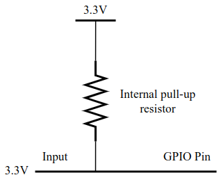
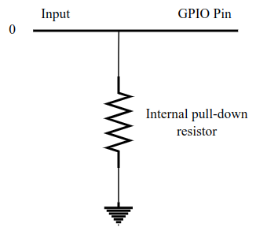
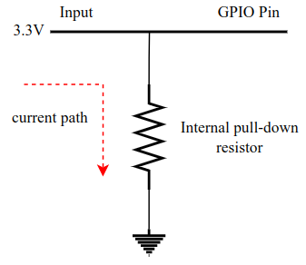
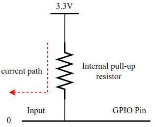
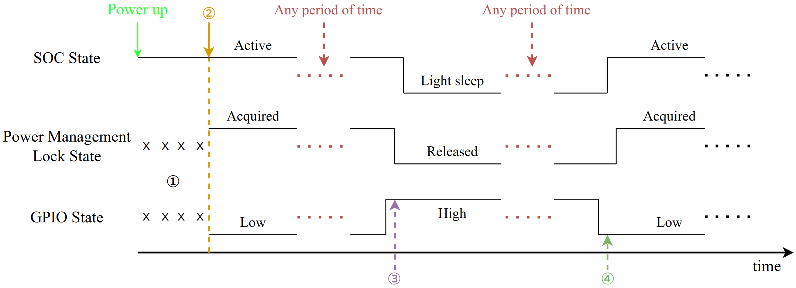
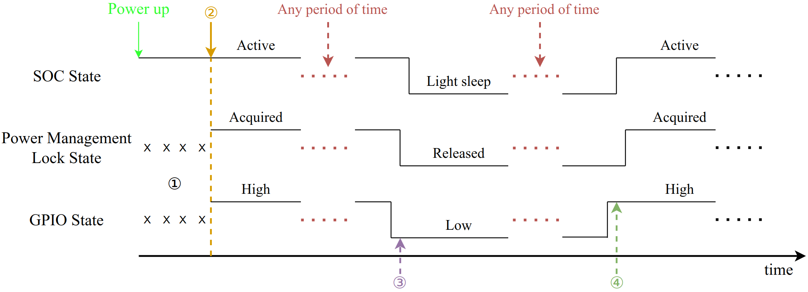
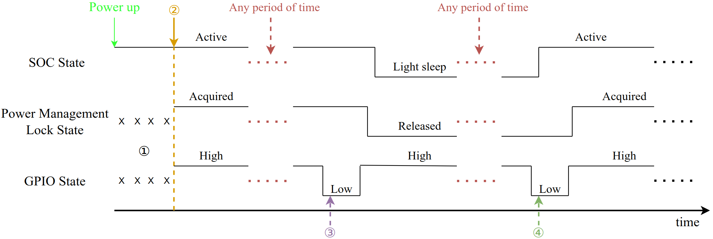
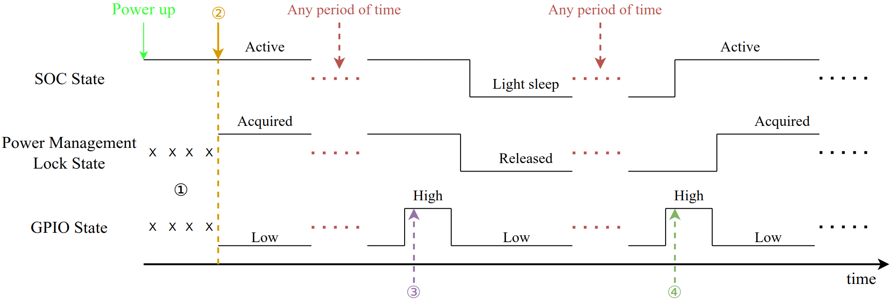

# External Power Control Example

(See the README.md file in the upper level 'examples' directory for more information about examples.)

ESP-IDF中的[电源管理单元](https://docs.espressif.com/projects/esp-idf/en/latest/api-reference/system/power_management.html)可以根据应用程序的需求，调整外围总线（APB）和CPU的频率，并使芯片进入[Light-sleep](https://docs.espressif.com/projects/esp-idf/en/latest/api-reference/system/sleep_modes.html#sleep-modes)模式，尽可能减少运行应用程序的功耗。应用程序通过调用`esp_pm_configure()`函数启用动态调频（DFS）和[auto Light-sleep](https://docs.espressif.com/projects/esp-idf/en/latest/api-reference/system/sleep_modes.html#api-reference)模式。另外，应用程序可以通过创建并获取[电源管理锁](https://docs.espressif.com/projects/esp-idf/en/latest/api-reference/system/power_management.html)来控制系统功耗。

该示例演示如何使用电源管理功能，通过[GPIO](https://docs.espressif.com/projects/esp-idf/en/latest/api-reference/peripherals/gpio.html#gpio-rtc-gpio)、[UART](https://docs.espressif.com/projects/esp-idf/en/latest/api-reference/peripherals/uart.html#uart)控制电源管理锁已实现控制系统功耗的功能，并提供了一套完整的控制逻辑。对于示例的解释，请看[Example Breakdown](#Example Breakdown)章节。

注：通过`menuconfig`可以配置该示例。（见[Configure the project](##Configure the project)章节）

警告：该项目使用了电源管理功能，因此必须启用[CONFIG_PM_ENABLE](https://docs.espressif.com/projects/esp-idf/en/latest/api-reference/kconfig.html#config-pm-enable)选项。另外，auto Light-sleep模式基于[FreeRTOS Tickless idle](https://freertos.org/low-power-tickless-rtos.html)功能，因此通过`esp_pm_configure()`使用auto Light-sleep功能时，必须启用[CONFIG_FREERTOS_USE_TICKLESS_IDLE](https://docs.espressif.com/projects/esp-idf/en/latest/api-reference/kconfig.html#config-freertos-use-tickless-idle)选项，否则`esp_pm_configure()`将返回 ESP_ERR_NOT_SUPPORTED 错误。

## How to use example

### Hardware Required

该示例能够在任何常用的ESP32系列开发板上运行，只需要向`menuconfig`中配置的GPIO引脚输入控制信号。

### Configure the project

```
idf.py set-target esp32xx
```

(Use specific soc model instead of xx)

```
idf.py menuconfig
```

* GPIO 引脚可以通过`Example configuration > GPIO configuration > Pin for gpio control`配置
* GPIO的控制方式可以通过`Example configuration > GPIO configuration > Enable GPIO pulse control`配置
* GPIO的控制电平可以通过`Example configuration > GPIO configuration > Enable GPIO high-level control`配置
* GPIO的上下拉可以通过`Example configuration > GPIO configuration > Use internal pull up and pull down`配置
* 示例所使用的UART可以通过`Example configuration > UART configuration > Select the UART to use`配置
* UART的tx引脚可以通过`Example configuration > UART configuration > Select the UART tx io`配置
* UART的rx引脚可以通过`Example configuration > UART configuration > Select the UART rx io`配置
* UART的cts引脚可以通过`Example configuration > UART configuration > Select the UART cts io`配置
* UART的rts引脚可以通过`Example configuration > UART configuration > Select the UART rts io`配置
* UART wakeup threshold可以通过`Example configuration > UART configuration > UART wakeup threshold`配置
* 定时器的超时时长可以通过`Example configuration > UART configuration > idle wait time (us)`配置
* 电源管理锁的类型可以通过`Example configuration > power manager configuration > Set pm lock`配置
* `esp_pm_configure()`中设置的最大频率可以通过`Example configuration > power manager configuration > Set max freq in pm config`配置
* `esp_pm_configure()`中设置的最小频率可以通过`Example configuration > power manager configuration > Set min freq in pm config`配置

有关以上的配置选项的解释，都可以通过`manuconfig`查看。

注：以上的配置选项都有默认值，使用`idf.py set-target esp32xx`设置目标开发板后，可以直接构建项目。

### Build and Flash

Build the project and flash it to the board, then run monitor tool to view serial output:

```
idf.py -p PORT flash monitor
```

(Replace PORT with the name of the serial port to use.)

(To exit the serial monitor, type ``Ctrl-]``.)

See the [Getting Started Guide](https://docs.espressif.com/projects/esp-idf/en/latest/get-started/index.html) for full steps to configure and use ESP-IDF to build projects.

## Example Output

由于示例支持电平和脉冲两种GPIO控制方式，再组合低电平或高电平唤醒，就有4种控制方式，但是它们的输出大同小异，所以这里只给出电平控制方式下低电平唤醒的输出示例。

根据设置的配置，初始化Power Management、GPIO和UART：

```
...
I (315) app_start: Starting scheduler on CPU0
I (320) main_task: Started on CPU0
I (320) main_task: Calling app_main()
I (320) pm: Frequency switching config: CPU_MAX: 160, APB_MAX: 80, API (340) uart: queue free spaces: 5
I (340) uart_control: UART control initialization complete
I (340) pm: Frequency switching config: CPU_MAX: 160, APB_MAX: 80, APB_MIN: 40, Light sleep: ENABLED
I (350) power_config: Acquired lock at [0x4081303c], system remains active
I (360) gpio: GPIO[6]| InputEn: 1| OutputEn: 0| OpenDrain: 0| Pullup: 0| Pulldown: 1| Intr:0 
Waiting for [GPIO6] to go low...
I (370) ext_power_ctrl_main: All init success
I (380) main_task: Returned from app_main()
...
```

根据输出可知，示例在等待GPIO 引脚变为低电平，此时将GPIO引脚置低：

```
...
I (4100) gpio_control: GPIO control initialization complete
...
```

### GPIO control

对于该示例，如果我们设置高电平唤醒，那么GPIO引脚输入高电平时就对应获取电源管理锁的操作，低电平对应释放电源管理锁的操作。相反的，如果我们设置低电平唤醒，那么GPIO引脚输入低电平时就对应获取锁的操作，高电平对应释放锁的操作。

在电平控制方式下，低电平唤醒时，GPIO引脚输入低电平，系统就会获取电源管理锁并保持活跃；GPIO引脚输入高电平时，系统就会释放电源管理锁，若系统此时空闲，就会进入Light-sleep。

我们对GPIO引脚不断输入高低电平，输出如下：

```
...
I (8370) gpio_control: Acquired lock at [0x4081303c], system remains active
I (9180) gpio_control: Released lock at [0x4081303c], system may sleep
I (10120) gpio_control: Acquired lock at [0x4081303c], system remains active
I (12230) gpio_control: Released lock at [0x4081303c], system may sleep
...
```

### UART control

对于该示例，默认的UART是绑定到默认控制台端口（UART_NUM_0），我们可以通过在键盘输入一些按键，从Light-sleep唤醒芯片。该示例中，我们设定UART唤醒后启动一个定时器，保证在一段时间内若没有接收到UART数据，就释放电源管理锁。

我们通过键盘输入字符‘u’，就会唤醒芯片并获取电源管理锁，之后就不再进行任何操作，过一段时间定时器超时，释放锁。输出如下：

```
I(15260) uart_control: Acquired lock at [0x4087cd38], system remains active
I (23270) uart_control: Released lock at [0x4087cd38], system may sleep
I (24700) uart_control: Acquired lock at [0x4087cd38], system remains active
```

注1：本例中UART唤醒阈值默认设置为3,这意味着输入字符的ascii码至少应该有3个沿，例如字符“0”的ascii码在二进制中是“0011 0000”，它只包含2个沿，所以字符“0”不足以唤醒芯片。

注2：仅支持UART0和UART1配置为唤醒源。对于ESP32,虽然它能够通过uart唤醒，但是没有uart 唤醒中断，也就不能执行获取锁的操作。

注3：由于硬件的限制，Light-sleep期间接收到的数据仅用于唤醒，不会被UART外设接收或传递给驱动程序。

## Troubleshooting

1. GPIO 唤醒只支持电平方式，GPIO 唤醒和GPIO中断使用了同一组配置寄存器，所以若使用“GPIO唤醒后，通过GPIO中断控制电源管理锁”的方式，那么GPIO中断也只能配置成电平方式。另外，我们还需要注意GPIO唤醒和GPIO中断的配置不能冲突，例如：先配置了GPIO唤醒为高电平，后面又配置了GPIO中断是低电平，那么就无法通过高电平唤醒芯片。

2. gpio control中的task中不能做阻塞的事情

   - 因为gpio中断服务程序中已经disable inr，当在task中enable intr之前，因为阻塞在某事件上，task被置于阻塞队列中，就有可能执行idle task，此时就会导致芯片进入Light-sleep模式，但是intr还没有重新使能，这就会导致再次唤醒后，无法触发gpio中断，也就无法操作电源锁。

3. 为保证 GPIO 能够成功唤醒芯片，需将 GPIO 配置为电平触发模式，并在中断回调函数中及时禁止 GPIO 中断源，防止频繁触发中断。

4. 漏电流问题

   - 经过测试，所有的soc都有同样的现象：采用脉冲控制时的Light-sleep功耗要比电平控制时的Light-sleep功耗**低大概80uA**（其他配置都相同）。这是因为电平控制模式下Light-sleep时，IO配置的内部上拉或下拉电阻与IO引脚的输入电平形成了通路，**上拉或下拉电阻导致的漏电流**。

   - 我们以ESP32-S3为例，对GPIO的4种控制方式进行说明：

     | 控制模式 | 唤醒电平 | Light-sleep时的电流(uA) | 内部上拉或下拉 | sleep时的电平 |
     | -------- | -------- | ----------------------- | -------------- | ------------- |
     | 脉冲     | LOW      | 180                     | 上拉电阻       | HIGH          |
     | 脉冲     | HIGH     | 191                     | 下拉电阻       | LOW           |
     | 电平     | LOW      | 262                     | 下拉电阻       | HIGH          |
     | 电平     | HIGH     | 258                     | 上拉电阻       | LOW           |

     漏电流大约为 80 uA，电压3.3 V，我们可以计算上拉、下拉电阻的阻值：

     **3.3 * 1000000 / 80 = 41250 Ω，所以推测的上下拉电阻阻值为41.3 KΩ**

   - 4种GPIO控制模式下，Light-sleep时的电路如下：

     - 脉冲-低电平唤醒

       

     - 脉冲-高电平唤醒

       

     - 电平-低电平唤醒

       

     - 电平-高电平唤醒

       

   - 为了避免上下拉电阻导致的漏电流，我们一般有两种方法：

     1. 不使用内部上下拉电阻，引脚输入电平由外部电路保证。
     2. 使用[gpio_sleep_sel_dis()](https://docs.espressif.com/projects/esp-idf/en/latest/api-reference/peripherals/gpio.html#_CPPv418gpio_sleep_sel_dis10gpio_num_t)功能，隔离Light-sleep时的GPIO引脚，使得外部电平不会影响该引脚。

5. 不建议flash掉电

   - flash作为一种存储介质，其上电和掉电的时候，都有严格的时序要求。(可以到具体型号的flash芯片数据手册中查看详细信息)
   - flash上电后，需要一段时间才能正常工作，如果上电后，立刻访问flash就会导致错误。
   - 另外，flash的电流不大，不会对Light-sleep时的功耗造成明显的影响，所以我们建议Light-sleep时，flash不要掉电。

6. UART时钟源的选择

   - 在IDF中，UART时钟源有几种不同的选择。我们以ESP32-S3为例，`UART_SCLK_DEFAULT`是APB时钟，但是APB的频率与CPU频率直接相关。**当CPU频率是PLL时，APB频率是80MHZ，否则就与CPU同频。**当我们使用Power Manager功能启用DFS后，CPU频率就会变化，那么对应的APB频率也就会变化。

     初始化时，CPU以最大频率运行，APB频率就是80MHZ，那么UART初始化时，就根据APB频率为80MHZ配置波特率，刚开始一切正常，当释放锁后，CPU可能会切换到最小频率，此时APB与CPU同频(一般是40MHZ，ESP32-H2除外)，但是UART不知道APB频率已经改变，它还是按照原先的80MHZ设置的波特率，但是实际频率是40MHZ，所以此时波特率错误，从而导致乱码。

   - 所以我们设置UART时钟源时，应该设置不受DFS功能影响的时钟源

7. Light-sleep时的功耗若偏高，可以设置`menuconfig`中的一些配置选项，以降低功耗

   - 配置Light-sleep时CPU掉电：`Component config > Power Management > Power down CPU in light sleep`
   - 对于ESP32-C6和ESP32-H2,如果不使用UART功能，可以配置数字外设掉电：`Component config > Power Management > Power down Digital Peripheral in light sleep (EXPERIMENTAL)`
   - 配置Wi-Fi和蓝牙的MAC、baseband掉电：`Component config > PHY > <ESP_PHY_MAC_BB_PD> Power down MAC and baseband of Wi-Fi and Bluetooth when PHY is disabled`
   - 配置PSRAM(如果SOC支持配置PSRAM)
     1. `Component config > ESP PSRAM > Support for external, SPI-connected RAM`
     2. `Component config > Hardware Settings > Sleep Config > Pull-up PSRAM CS pin in light sleep (NEW)`

8. 芯片active时的功耗（需结合电流表查看实时电流）

   - 若周期性出现小电流峰值，则考虑某些任务正在执行。
   - 若芯片无法睡眠，则考虑是否有任务延迟时间小于参数 `Minimum number of ticks to enter sleep mode for` 设置值。此外，也需检查电源管理锁是否仍未释放，可在 menuconfig 中打开 `Enable profiling counters for PM locks` 选项，在程序中周期性调用 `esp_pm_dump_locks(stdout)` 查看当前各种管理锁占用时间等信息，debug 结束后，需关闭该选项以减小开销。另外也可以打开 `Enable debug tracing of PM using GPIOs` 选项进行 GPIO 调试，详见 [pm_trace.c](https://github.com/espressif/esp-idf/blob/master/components/esp_pm/pm_trace.c)。

9. Light-sleep 模式下串口输出断断续续

   当芯片进入 Light-sleep 模式时，UART FIFO 不会被冲刷。与之相反，UART 输出将被暂停，FIFO 中的剩余字符将在 Light-sleep 唤醒后被发送。可在需要发送的位置后增加 `uart_wait_tx_idle_polling()`，以达到发送完成后才进入睡眠的效果。

10. 低功耗模式下应用程序运行异常

    当使能Power Management后，系统将会在 `max_freq_mhz` 和 `min_freq_mhz` 之间动态切换，任务如果对系统频率（CPU频率）有要求，则需要创建并维护满足任务需求的电源管理锁，如 `ESP_PM_CPU_FREQ_MAX`。

## Example Breakdown

该示例使用[GPIO](https://docs.espressif.com/projects/esp-idf/en/latest/api-reference/peripherals/gpio.html#gpio-rtc-gpio)、[UART](https://docs.espressif.com/projects/esp-idf/en/latest/api-reference/peripherals/uart.html#uart)实现了一套完整的电源管理控制逻辑，演示如何通过控制电源管理锁以实现控制系统功耗的功能。这其中最主要的就是GPIO控制和UART控制两个部分。

### GPIO Control

GPIO控制的大致思想：通过GPIO输入电平触发中断，中断服务程序向一个GPIO task抛事件，task中完成对电源管理锁的操作。

该示例实现了电平和脉冲两种GPIO控制方式（具体解释，请看下文），并且GPIO Wakeup也有高电平唤醒和低电平唤醒两种方式，那么它们组合起来，就有四种GPIO控制模式，分别是：

1. Level Mode-Low Level
2. Level Mode-High Level
3. Pulse Mode-Low Level
4. Pulse Mode-High Level

#### Level Mode

电平控制模式的特点是，GPIO输入电平一直与芯片状态对应。

电平模式的控制流程，主要包含三个过程：

1. 初始化：配置电源管理功能 -> 创建电源管理锁 -> 获取电源管理锁（上电后，系统应该保持active状态） -> 创建GPIO task -> GPIO初始化 -> 等待GPIO输入电平到特定状态（例如：若是设置GPIO低电平唤醒芯片，那么就要等待GPIO的初始电平是低电平） -> 设置GPIO唤醒方式 -> 设置GPIO中断
2. 释放电源管理锁：GPIO触发中断 -> 中断服务程序向GPIO task抛释放锁的事件 -> GPIO task释放电源管理锁 -> 芯片进入Light sleep
3. 获取电源管理锁：GPIO唤醒芯片 -> GPIO触发中断 -> 中断服务程序向GPIO task抛获取锁的事件 -> GPIO task获取电源管理锁 -> 芯片保持active

对于不同的唤醒电平，又有一些区别。

注：GPIO task的优先级要高于0级，因为idle task的优先级是0级。

##### Low Level



1. 开发板刚上电，还未初始化，所以电源管理锁和GPIO状态都不确定。
2. 初始化
   1. 由于上电后芯片应该保持active，对应的GPIO状态是低电平，所以GPIO初始化时，设置内部下拉电阻（示例默认使用内部上下拉电阻，也可以配置为不使用），保证GPIO输入低电平。
   2. 设置GPIO唤醒电平为低电平。由于ESP-C6和ESP-H2支持digital peripherals掉电，所以如果配置了digital peripherals掉电，应使用lp io 唤醒 或者 ext1 唤醒。
   3. 由于低电平对应获取锁的状态，那么高电平就对应释放锁的状态，所以设置下一次的GPIO中断为高电平中断。
3. 释放锁
   1. GPIO输入高电平，触发GPIO中断，由于GPIO再变为低电平时，应该获取锁，所以立刻修改下一次的中断触发类型为低电平。
   2. 中断服务程序向GPIO task中抛释放锁的事件。
   3. GPIO task中完成释放锁的操作，之后芯片进入Light sleep。
4. 获取锁
   1. GPIO输入低电平，芯片被唤醒，并触发GPIO中断，由于GPIO再变为高电平时，应该释放锁，所以立刻修改下一次的中断触发类型为高电平。
   2. 中断服务程序向GPIO task中抛获取锁的事件。
   3. GPIO task中完成获取锁的操作，之后芯片保持active。

##### High Level



1. 开发板刚上电，还未初始化，所以电源管理锁和GPIO状态都不确定。
2. 初始化
   1. 由于上电后芯片应该保持active，对应的GPIO状态是高电平，所以GPIO初始化时，设置内部上拉电阻（示例默认使用内部上下拉电阻，也可以配置为不使用），保证GPIO输入高电平。
   2. 设置GPIO唤醒电平为高电平。由于ESP-C6和ESP-H2支持digital peripherals掉电，所以如果配置了digital peripherals掉电，应使用lp io 唤醒 或者 ext1 唤醒。
   3. 由于高电平对应获取锁的状态，那么低电平就对应释放锁的状态，所以设置下一次的GPIO中断为低电平中断。
3. 释放锁
   1. GPIO输入低电平，触发GPIO中断，由于GPIO再变为高电平时，应该获取锁，所以立刻修改下一次的中断触发类型为高电平。
   2. 中断服务程序向GPIO task中抛释放锁的事件。
   3. GPIO task中完成释放锁的操作，之后芯片进入Light sleep。
4. 获取锁
   1. GPIO输入高电平，芯片被唤醒，并触发GPIO中断，由于GPIO再变为低电平时，应该释放锁，所以立刻修改下一次的中断触发类型为低电平。
   2. 中断服务程序向GPIO task中抛获取锁的事件。
   3. GPIO task中完成获取锁的操作，之后芯片保持active。

#### Pulse Mode

脉冲控制模式的特点是，触发一次完整的脉冲，芯片状态就会改变。

脉冲控制模式不同点有两个：

1. 触发中断后，需要检测到完整的脉冲后，再操作电源管理锁。
2. GPIO中断类型一直保持不变。

脉冲模式的控制流程，主要包含三个过程：

1. 初始化：配置电源管理功能 -> 创建电源管理锁 -> 获取电源管理锁（上电后，系统应该保持active状态） -> 创建GPIO task -> GPIO初始化 -> 等待GPIO输入电平到特定状态（例如：如果配置高电平中断，那么就要等待GPIO输入低电平） -> 设置GPIO唤醒方式 -> 设置GPIO中断
2. 释放电源管理锁：GPIO触发中断 -> 中断服务程序向GPIO task抛检测脉冲的事件 -> GPIO task检测到脉冲后，释放电源管理锁 -> 芯片进入Light sleep
3. 获取电源管理锁：GPIO唤醒芯片 -> GPIO触发中断 -> 中断服务程序向GPIO task抛检测脉冲的事件 -> GPIO task检测到脉冲后，获取电源管理锁 -> 芯片保持active

对于不同的唤醒电平，又有一些区别。

注1：GPIO task的优先级要高于0级，因为idle task的优先级是0级。

注2：使用脉冲模式时，要注意去抖，防止因为抖动而导致无法检测到完整脉冲。我们建议GPIO输入信号应保证是去抖的。

##### Low Level



1. 开发板刚上电，还未初始化，所以电源管理锁和GPIO状态都不确定。
2. 初始化
   1. 由于设置的低电平触发中断，所以GPIO初始化时，设置内部上拉电阻（示例默认使用内部上下拉电阻，也可以配置为不使用），保证GPIO输入高电平。
   2. 设置GPIO唤醒电平为低电平。由于ESP-C6和ESP-H2支持digital peripherals掉电，所以如果配置了digital peripherals掉电，应使用lp io 唤醒 或者 ext1 唤醒。
   3. 设置低电平中断。
3. 释放锁
   1. GPIO输入低电平，触发GPIO中断，中断服务程序向GPIO task中检测脉冲的事件。
   2. GPIO task检测到脉冲后，完成释放锁的操作，之后芯片进入Light sleep。
4. 获取锁
   1. GPIO输入低电平，芯片被唤醒，并触发GPIO中断，中断服务程序向GPIO task中检测脉冲的事件。
   2. GPIO task检测到脉冲后，完成获取锁的操作，之后芯片保持active。

##### High Level



1. 开发板刚上电，还未初始化，所以电源管理锁和GPIO状态都不确定。
2. 初始化
   1. 由于设置的高电平触发中断，所以GPIO初始化时，设置内部下拉电阻（示例默认使用内部上下拉电阻，也可以配置为不使用），保证GPIO输入低电平。
   2. 设置GPIO唤醒电平为高电平。由于ESP-C6和ESP-H2支持digital peripherals掉电，所以如果配置了digital peripherals掉电，应使用lp io 唤醒 或者 ext1 唤醒。
   3. 设置高电平中断。
3. 释放锁
   1. GPIO输入高电平，触发GPIO中断，中断服务程序向GPIO task中检测脉冲的事件。
   2. GPIO task检测到脉冲后，完成释放锁的操作，之后芯片进入Light sleep。
4. 获取锁
   1. GPIO输入高电平，芯片被唤醒，并触发GPIO中断，中断服务程序向GPIO task中检测脉冲的事件。
   2. GPIO task检测到脉冲后，完成获取锁的操作，之后芯片保持active。

### UART Control

UART控制的大致思想：通过UART唤醒芯片，获取电源管理锁，芯片保持active，空闲（没有接收到UART数据）一段时间后，再释放锁，芯片进入Light sleep。

UART控制模式比GPIO控制更简单，主要包含三个过程：

1. 初始化：配置电源管理功能 -> 创建电源管理锁 -> 获取电源管理锁（上电后，系统应该保持active状态） -> UART初始化 -> 配置UART唤醒 -> 创建UART task -> 创建timer
2. 释放电源管理锁：一段时间未接收到UART数据后，timer超时，触发timer callback，callback中释放电源管理锁，芯片进入Light sleep
3. 获取电源管理锁：UART唤醒芯片，UART task收到UART唤醒事件，从而获取电源管理锁，芯片保持active

