| Supported Targets | ESP32 | ESP32-C2 | ESP32-C3 | ESP32-C6 | ESP32-H2 | ESP32-S2 | ESP32-S3 |
| ----------------- | ----- | -------- | -------- | -------- | -------- | -------- | -------- |

注：在该示例中，ESP32 只支持 GPIO Control

# External Power Control Example

(See the README.md file in the upper level 'examples' directory for more information about examples.)

该示例演示如何使用[电源管理](https://docs.espressif.com/projects/esp-idf/en/latest/api-reference/system/power_management.html)功能，通过 [GPIO](https://docs.espressif.com/projects/esp-idf/en/latest/api-reference/peripherals/gpio.html#gpio-rtc-gpio)、[UART](https://docs.espressif.com/projects/esp-idf/en/latest/api-reference/peripherals/uart.html#uart) 控制[电源管理锁](https://docs.espressif.com/projects/esp-idf/en/latest/api-reference/system/power_management.html)已实现控制系统功耗的功能，并提供了一套完整的控制逻辑。

1. 该示例支持 GPIO 控制的电源管理和 [auto light sleep](https://docs.espressif.com/projects/esp-idf/en/latest/api-reference/system/sleep_modes.html#api-reference) 功能，并支持两种控制模式。

   - 电平控制：GPIO 输入电平一直与芯片状态对应。

   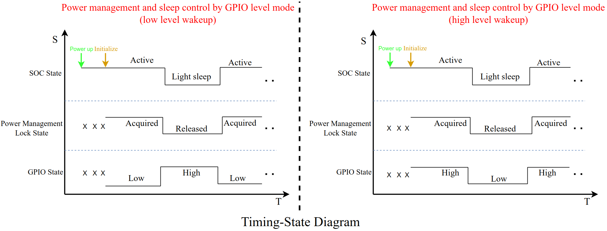

   - 脉冲控制：触发一次完整的脉冲，芯片状态就会改变。

   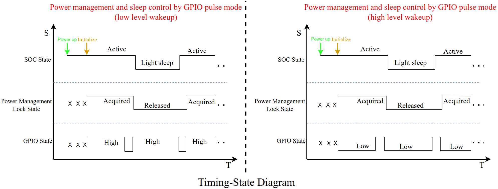

2. 该示例同时支持 UART 控制的电源管理和 auto light sleep 功能。

注1：通过 `menuconfig` 可配置该示例。（见 [Configure the project](##Configure the project) 章节）

注2：对于示例的解释，请看 [Example Breakdown](#Example Breakdown) 章节。

警告：该项目使用了电源管理功能，因此必须启用 [CONFIG_PM_ENABLE](https://docs.espressif.com/projects/esp-idf/en/latest/api-reference/kconfig.html#config-pm-enable) 选项。另外，auto light sleep 模式基于 [FreeRTOS Tickless idle](https://freertos.org/low-power-tickless-rtos.html) 功能，因此通过 `esp_pm_configure()` 使用 auto light sleep 功能时，必须启用 [CONFIG_FREERTOS_USE_TICKLESS_IDLE](https://docs.espressif.com/projects/esp-idf/en/latest/api-reference/kconfig.html#config-freertos-use-tickless-idle) 选项，否则 `esp_pm_configure()` 将返回 ESP_ERR_NOT_SUPPORTED 错误。

## How to use example

### Hardware Required

该示例通常能够在任何常用的 ESP32 系列开发板上运行。

### Configure the project

```
idf.py set-target esp32xx
```

(Use specific soc model instead of xx)

```
idf.py menuconfig
```

* GPIO 引脚配置：`(Top) -> Example Configuration -> GPIO configuration -> Pin for gpio control`
* GPIO 控制模式配置：`(Top) -> Example Configuration -> GPIO configuration -> Enable GPIO pulse control`
* GPIO 控制电平配置：`(Top) -> Example Configuration -> GPIO configuration -> Enable GPIO high-level control`
* GPIO 上下拉配置：`(Top) -> Example Configuration -> GPIO configuration -> Use internal pull up and pull down`
* UART 配置：`(Top) -> Example Configuration -> UART configuration -> Select the UART to use`
* UART 的 tx 引脚配置：`(Top) -> Example Configuration -> UART configuration -> Select the UART tx io`
* UART 的 rx 引脚配置：`(Top) -> Example Configuration -> UART configuration -> Select the UART rx io`
* UART 的 cts 引脚配置：`(Top) -> Example Configuration -> UART configuration -> Select the UART cts io`
* UART 的 rts 引脚配置：`(Top) -> Example Configuration -> UART configuration -> Select the UART rts io`
* UART wakeup threshold 配置：`(Top) -> Example Configuration -> UART configuration -> UART wakeup threshold`
* 定时器配置：`(Top) -> Example Configuration -> UART configuration -> idle wait time (us)`
* 电源管理锁配置：`(Top) -> Example Configuration -> power manager configuration -> Set pm lock`
* 电源管理配置：`(Top) -> Example Configuration -> power manager configuration -> Set max freq in pm config`
* 电源管理配置：`(Top) -> Example Configuration -> power manager configuration -> Set min freq in pm config`

有关上述配置选项的解释，可以通过 `manuconfig` 查看。

注：上述配置选项都有默认值，使用 `idf.py set-target esp32xx` 设置目标开发板后，可以直接构建项目。

### Build and Flash

Build the project and flash it to the board, then run monitor tool to view serial output:

```
idf.py -p PORT flash monitor
```

(Replace PORT with the name of the serial port to use.)

(To exit the serial monitor, type ``Ctrl-]``.)

See the [Getting Started Guide](https://docs.espressif.com/projects/esp-idf/en/latest/get-started/index.html) for full steps to configure and use ESP-IDF to build projects.

## Example Output

由于示例支持电平和脉冲两种 GPIO 控制方式，再组合低电平或高电平唤醒，就有 4 种控制方式，但是它们的输出大同小异，所以这里只给出电平控制方式下低电平唤醒的输出示例。

根据设置的配置，初始化 Power Management、GPIO 和 UART：

```
...
I (315) app_start: Starting scheduler on CPU0
I (320) main_task: Started on CPU0
I (320) main_task: Calling app_main()
I (320) pm: Frequency switching config: CPU_MAX: 160, APB_MAX: 80, API (340) uart: queue free spaces: 5
I (340) uart_control: UART control initialization complete
I (340) pm: Frequency switching config: CPU_MAX: 160, APB_MAX: 80, APB_MIN: 40, Light sleep: ENABLED
I (350) power_config: Acquired lock at [0x4081303c], system remains active
I (360) gpio: GPIO[6]| InputEn: 1| OutputEn: 0| OpenDrain: 0| Pullup: 0| Pulldown: 1| Intr:0 
Waiting for [GPIO6] to go low...
I (370) ext_power_ctrl_main: All init success
I (380) main_task: Returned from app_main()
...
```

根据输出可知，示例在等待 GPIO 引脚变为低电平，此时将 GPIO 引脚置低：

```
...
I (4100) gpio_control: GPIO control initialization complete
...
```

### GPIO control

对于该示例，如果设置高电平唤醒，那么 GPIO 引脚输入高电平时就对应获取电源管理锁的操作，低电平对应释放电源管理锁的操作。相反的，如果设置低电平唤醒，那么 GPIO 引脚输入低电平就对应获取锁的操作，高电平对应释放锁的操作。

在电平控制方式下，低电平唤醒时，GPIO 引脚输入低电平，系统就会获取电源管理锁并保持活跃；GPIO 引脚输入高电平时，系统就会释放电源管理锁，若系统此时空闲，就会进入 auto light sleep。

GPIO 引脚不断输入高低电平，输出如下：

```
...
I (8370) gpio_control: Acquired lock at [0x4081303c], system remains active
I (9180) gpio_control: Released lock at [0x4081303c], system may sleep
I (10120) gpio_control: Acquired lock at [0x4081303c], system remains active
I (12230) gpio_control: Released lock at [0x4081303c], system may sleep
...
```

### UART control

对于该示例，默认的 UART 是绑定到默认控制台端口（UART_NUM_0），通过在键盘输入字符，从 light sleep 唤醒芯片。该示例中，UART 唤醒后启动一个定时器，保证在一段时间内若没有接收到 UART 数据，就释放电源管理锁。

通过键盘输入字符 ‘u’，就会唤醒芯片并获取电源管理锁，之后就不再进行任何操作，过一段时间定时器超时，释放锁。输出如下：

```
I(15260) uart_control: Acquired lock at [0x4087cd38], system remains active
I (23270) uart_control: Released lock at [0x4087cd38], system may sleep
I (24700) uart_control: Acquired lock at [0x4087cd38], system remains active
```

注1：本例中 UART 唤醒阈值默认设置为 3，这意味着输入字符的 ascii 码至少应该有3个沿，例如字符 “0” 的 ascii 码在二进制中是 “0011 0000”，它只包含 2 个沿，所以字符 “0” 不足以唤醒芯片。

注2：仅支持 UART0 和 UART1 配置为唤醒源。对于 ESP32，虽然它能够通过 uart 唤醒，但是没有 uart 唤醒中断，也就不能执行获取锁的操作。

注3：light sleep 期间接收到的数据仅用于唤醒，不会被 UART 外设接收或传递给驱动程序。

## Troubleshooting

1. GPIO 唤醒支持电平方式，GPIO 唤醒和 GPIO 中断使用了同一组配置寄存器，所以若使用 “GPIO 唤醒后，通过 GPIO 中断控制电源管理锁” 的方式，那么GPIO中断也只能配置成电平方式。另外，GPIO 唤醒和 GPIO 中断的配置不能冲突，例如：先配置了 GPIO 唤醒为高电平，后面又配置了 GPIO 中断是低电平，那么就无法通过高电平唤醒芯片。

2. gpio control 中的 task 中不能做阻塞的事情

   - 因为 GPIO 中断服务程序中已经 disable gpio 中断，当在 task 中 enable 中断之前，因为阻塞在某事件上，task 被置于阻塞队列中，就有可能执行 idle task，此时就会导致芯片进入 auto light sleep 模式，但是 GPIO 中断还没有重新使能，这就会导致再次唤醒后，无法触发 GPIO 中断，也就无法操作电源锁。

3. 为保证 GPIO 能够成功唤醒芯片，需将 GPIO 配置为电平触发模式，并在中断回调中及时禁止 GPIO 中断源，防止频繁触发中断。

4. 漏电流问题

   - 经过测试，所有的 soc 都有同样的现象：采用脉冲控制时的 light sleep 功耗要比电平控制时的 light sleep 功耗**低大概80uA**（其他配置都相同）。这是因为电平控制模式下 light sleep 时，IO 配置的内部上拉或下拉电阻与 IO 引脚的输入电平形成了通路，**上拉或下拉电阻导致的漏电流**。

   - 以 ESP32-S3 为例，对 GPIO 的4种控制方式进行说明：

     | 控制模式 | 唤醒电平 | Light sleep 时的电流 (uA) | 内部上拉或下拉 | sleep 时的电平 |
     | -------- | -------- | ------------------------- | -------------- | -------------- |
     | 脉冲     | LOW      | 180                       | 上拉电阻       | HIGH           |
     | 脉冲     | HIGH     | 191                       | 下拉电阻       | LOW            |
     | 电平     | LOW      | 262                       | 下拉电阻       | HIGH           |
     | 电平     | HIGH     | 258                       | 上拉电阻       | LOW            |

     漏电流大约为 80 uA，电压 3.3 V，进而可以计算上拉、下拉电阻的阻值：

     **3.3 * 1000000 / 80 = 41250 Ω，所以推测的上下拉电阻阻值为41.3 KΩ**

   - 4种 GPIO 控制模式下，light sleep 时的电路如下：

     - 脉冲-低电平唤醒

       

     - 脉冲-高电平唤醒

       

     - 电平-低电平唤醒

       

     - 电平-高电平唤醒

       

   - 为了避免上下拉电阻导致的漏电流，可以尝试以下两种方法：

     1. 不使用内部上下拉电阻，引脚输入电平由外部电路保证。
     2. 使用 [gpio_sleep_sel_dis()](https://docs.espressif.com/projects/esp-idf/en/latest/api-reference/peripherals/gpio.html#_CPPv418gpio_sleep_sel_dis10gpio_num_t) 功能，隔离 light sleep 时的 GPIO 引脚，使得外部电平不会影响该引脚。

5. 不建议 flash 掉电

   - flash 作为一种存储介质，其上电和掉电的时候，都有严格的时序要求。(可以到具体型号的 flash 芯片数据手册中查看详细信息)
   - flash 上电后，需要一段时间才能正常工作，如果上电后，立刻访问 flash 就会导致错误。
   - 另外，flash 的电流不大，不会对 light sleep 时的功耗造成明显的影响，所以芯片 light sleep 时，flash不要掉电。

6. UART 时钟源的选择

   - 在 IDF 中，UART 时钟源有几种不同的选择。以 ESP32-S3 为例，`UART_SCLK_DEFAULT` 是APB时钟，但是 APB 的频率与 CPU 频率直接相关。**当 CPU 频率是 PLL 时，APB 频率是 80 MHZ，否则就与 CPU 同频。**使用 Power Manager 功能启用动态切频后，CPU 频率就会变化，那么对应的 APB 频率也就会变化。

     初始化时，CPU 以最大频率运行，APB 频率就是 80 MHZ，那么 UART 初始化时，就根据 APB 频率为 80 MHZ 配置波特率，刚开始一切正常，当释放锁后，CPU 可能会切换到最小频率，此时 APB 与 CPU 同频（一般是 40 MHZ，ESP32-H2 除外），但是 UART 不知道 APB 频率已经改变，它还是按照原先的 80 MHZ 设置的波特率，但是实际频率是 40 MHZ，所以此时波特率错误，从而导致乱码。

   - 设置 UART 时钟源时，应该设置不受动态切频功能影响的时钟源。

7. Light sleep 时的功耗若偏高，可以设置 `menuconfig` 中的一些配置选项，以降低功耗

   - 配置 light sleep 时 CPU 掉电：`(Top) -> Component config -> Power Management -> Power down CPU in light sleep`
   - 对于 ESP32-C6 和 ESP32-H2，如果不使用 UART 功能，可以配置数字外设掉电：`(Top) -> Component config -> Power Management -> Power down Digital Peripheral in light sleep (EXPERIMENTAL)`
   - 配置 Wi-Fi 和蓝牙的 MAC、baseband 掉电：`(Top) -> Component config -> PHY -> <ESP_PHY_MAC_BB_PD> Power down MAC and baseband of Wi-Fi and Bluetooth when PHY is disabled`
   - 配置 PSRAM（如果 SOC 支持配置 PSRAM ）
     1. `(Top) -> Component config -> ESP PSRAM -> Support for external, SPI-connected RAM`
     2. `(Top) -> Component config -> Hardware Settings -> Sleep Config -> Pull-up PSRAM CS pin in light sleep (NEW)`

8. 芯片 active 时的功耗（需结合电流表查看实时电流）

   - 若周期性出现小电流峰值，则考虑某些任务正在执行。
   - 若芯片无法睡眠，则考虑是否有任务延迟时间小于参数 `Minimum number of ticks to enter sleep mode for` 设置值。此外，也需检查电源管理锁是否仍未释放，可在 menuconfig 中打开 `Enable profiling counters for PM locks` 选项，在程序中周期性调用 `esp_pm_dump_locks(stdout)` 查看当前各种管理锁占用时间等信息，debug 结束后，需关闭该选项以减小开销。另外也可以打开 `Enable debug tracing of PM using GPIOs` 选项进行 GPIO 调试，详见 [pm_trace.c](https://github.com/espressif/esp-idf/blob/master/components/esp_pm/pm_trace.c)。

9. Light sleep 模式下串口输出断断续续

   当芯片进入 light sleep 模式时，UART 数据缓冲区不会被冲刷。与之相反，UART 输出将被暂停，FIFO 中的剩余字符将在 light sleep 唤醒后被发送。可在需要发送的位置后增加 `uart_wait_tx_idle_polling()`，以达到发送完成后才进入睡眠的效果。

10. 低功耗模式下应用程序运行异常

    当使能 Power Management 后，系统将会在 `max_freq_mhz` 和 `min_freq_mhz` 之间动态切换，任务如果对系统性能有要求，则需要创建并维护满足任务需求的电源管理锁，如 `ESP_PM_CPU_FREQ_MAX`。

## Example Breakdown

该示例使用 [GPIO](https://docs.espressif.com/projects/esp-idf/en/latest/api-reference/peripherals/gpio.html#gpio-rtc-gpio)、[UART](https://docs.espressif.com/projects/esp-idf/en/latest/api-reference/peripherals/uart.html#uart) 实现了一套完整的电源管理控制逻辑，演示如何通过控制电源管理锁以实现控制系统功耗的功能。这其中最主要的就是 GPIO 控制和 UART 控制两个部分。

### GPIO Control

GPIO 控制的大致思想：通过 GPIO 输入电平触发中断，中断服务程序向一个 GPIO task 抛事件，task 中完成对电源管理锁的操作。

该示例实现了电平和脉冲两种 GPIO 控制方式（具体解释，请看下文），并且 GPIO wakeup 也有高电平唤醒和低电平唤醒两种方式，那么它们组合起来，就有四种 GPIO 控制模式，分别是：

1. Level Mode-Low Level
2. Level Mode-High Level
3. Pulse Mode-Low Level
4. Pulse Mode-High Level

#### Level Mode

电平控制模式的特点是，GPIO 输入电平一直与芯片状态对应。

电平模式的控制流程，主要包含三个过程。首先进行初始化，之后某一时刻 GPIO 输入电平改变，触发释放电源管理锁，芯片进入 auto light sleep 的流程。当 GPIO 输入电平再次改变时，触发唤醒芯片，获取电源管理锁，芯片保持 active 的流程。

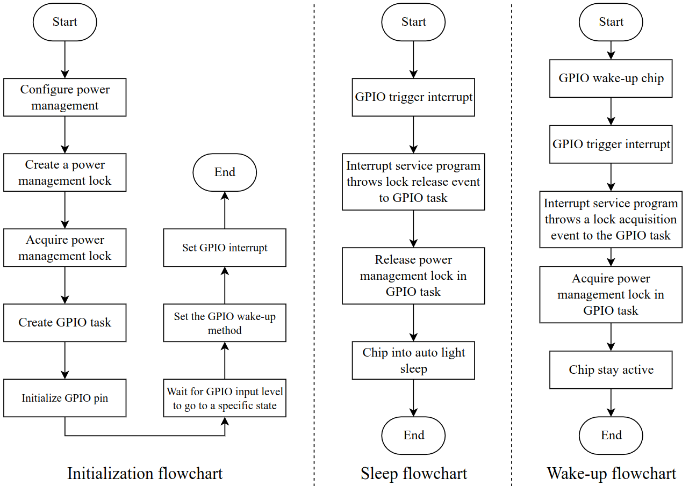

注：GPIO task 的优先级要高于 0 级，因为 idle task 的优先级是 0 级。

##### Low Level

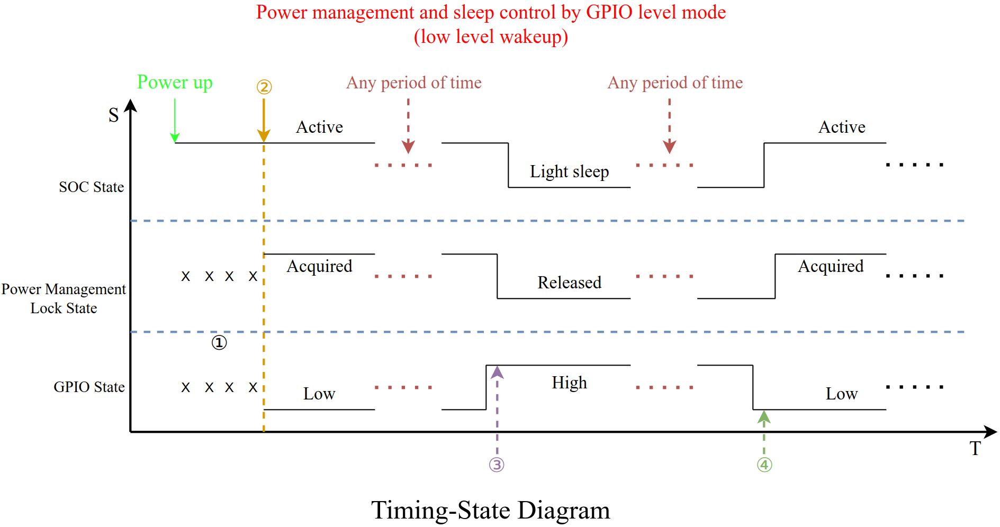

1. 开发板刚上电，还未初始化，所以电源管理锁和 GPIO 状态都不确定。
2. 初始化
   1. 由于上电后芯片应该保持 active，对应的 GPIO 状态是低电平，所以 GPIO 初始化时，设置内部下拉电阻（示例默认使用内部上下拉电阻，也可以配置为不使用），保证 GPIO 输入低电平。
   2. 设置 GPIO 唤醒电平为低电平。由于 ESP-C6 和 ESP-H2 支持 digital peripherals 掉电，所以如果配置了 digital peripherals 掉电，应使用 lp io 唤醒 或者 ext1 唤醒。
   3. 由于低电平对应获取锁的状态，那么高电平就对应释放锁的状态，所以设置下一次的 GPIO 中断为高电平中断。
3. 释放锁
   1. GPIO 输入高电平，触发 GPIO 中断，由于 GPIO 再变为低电平时，应该获取锁，所以立刻修改下一次的中断触发类型为低电平。
   2. 中断服务程序向 GPIO task 中抛释放锁的事件。
   3. GPIO task 中完成释放锁的操作，之后芯片进入 auto light sleep。
4. 获取锁
   1. GPIO 输入低电平，芯片被唤醒，并触发 GPIO 中断，由于 GPIO 再变为高电平时，应该释放锁，所以立刻修改下一次的中断触发类型为高电平。
   2. 中断服务程序向 GPIO task 中抛获取锁的事件。
   3. GPIO task 中完成获取锁的操作，之后芯片保持 active。

该模式的软件状态机，如下：

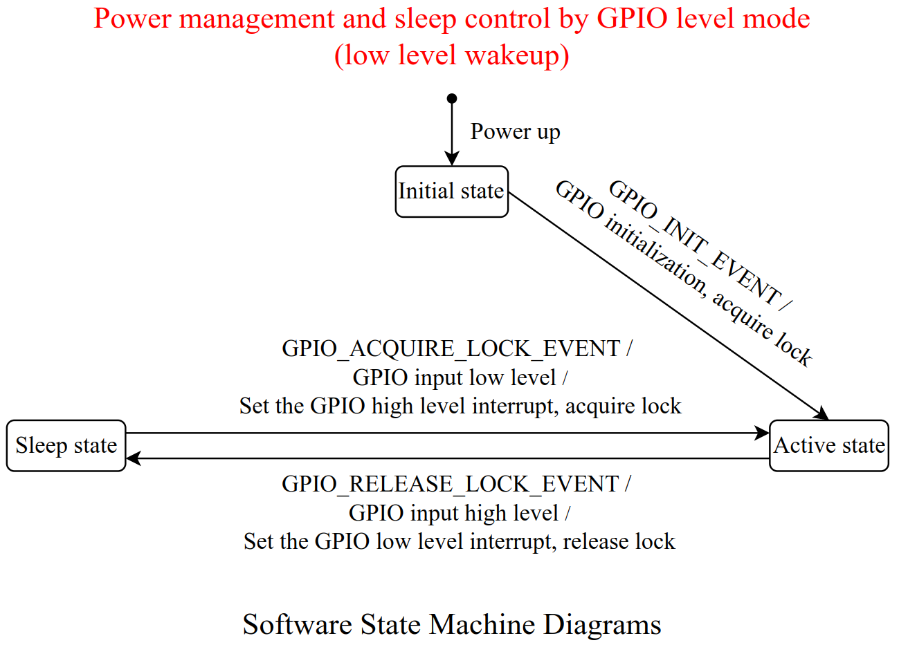

##### High Level

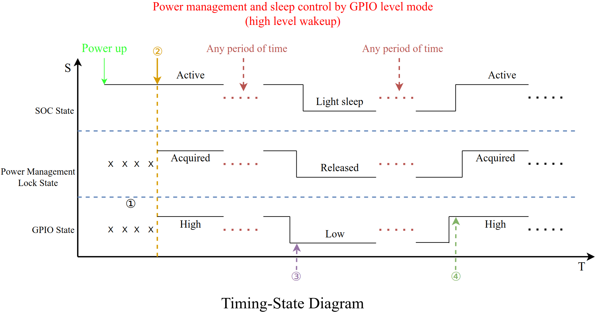

1. 开发板刚上电，还未初始化，所以电源管理锁和 GPIO 状态都不确定。
2. 初始化
   1. 由于上电后芯片应该保持 active，对应的 GPIO 状态是高电平，所以 GPIO 初始化时，设置内部上拉电阻（示例默认使用内部上下拉电阻，也可以配置为不使用），保证 GPIO 输入高电平。
   2. 设置 GPIO 唤醒电平为高电平。由于 ESP-C6 和 ESP-H2 支持 digital peripherals 掉电，所以如果配置了 digital peripherals 掉电，应使用 lp io 唤醒 或者 ext1 唤醒。
   3. 由于高电平对应获取锁的状态，那么低电平就对应释放锁的状态，所以设置下一次的 GPIO 中断为低电平中断。
3. 释放锁
   1. GPIO 输入低电平，触发 GPIO 中断，由于 GPIO 再变为高电平时，应该获取锁，所以立刻修改下一次的中断触发类型为高电平。
   2. 中断服务程序向 GPIO task 中抛释放锁的事件。
   3. GPIO task 中完成释放锁的操作，之后芯片进入 auto light sleep。
4. 获取锁
   1. GPIO 输入高电平，芯片被唤醒，并触发 GPIO 中断，由于 GPIO 再变为低电平时，应该释放锁，所以立刻修改下一次的中断触发类型为低电平。
   2. 中断服务程序向 GPIO task 中抛获取锁的事件。
   3. GPIO task 中完成获取锁的操作，之后芯片保持 active。

该模式的软件状态机如下：

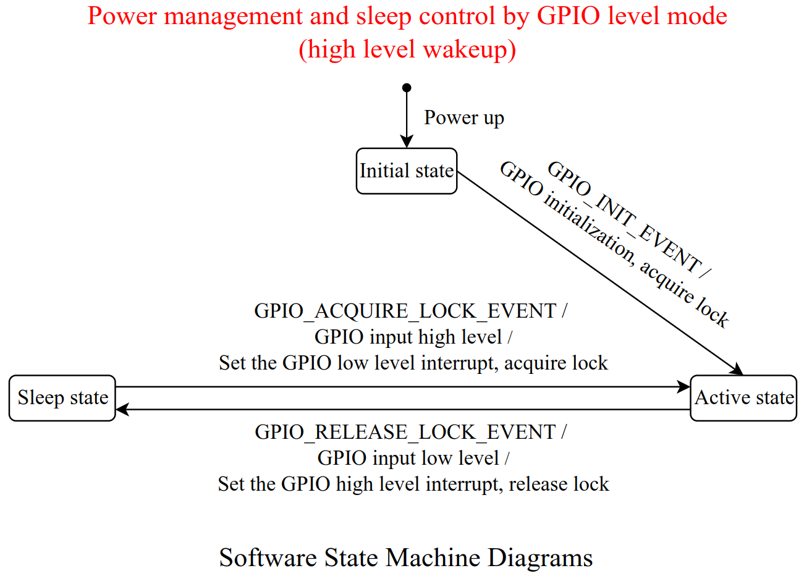

#### Pulse Mode

脉冲控制模式的特点是，触发一次完整的脉冲，芯片状态就会改变。

脉冲控制模式不同点有两个：

1. 触发中断后，需要检测到完整的脉冲后，再操作电源管理锁。
2. GPIO 中断类型一直保持不变。

脉冲模式的控制流程，主要包含三个过程，首先进行初始化，之后某一时刻 GPIO 输入脉冲，触发释放电源管理锁，芯片进入 auto light sleep 的流程。当 GPIO 再次输入脉冲时，触发唤醒芯片，获取电源管理锁，芯片保持 active 的流程。

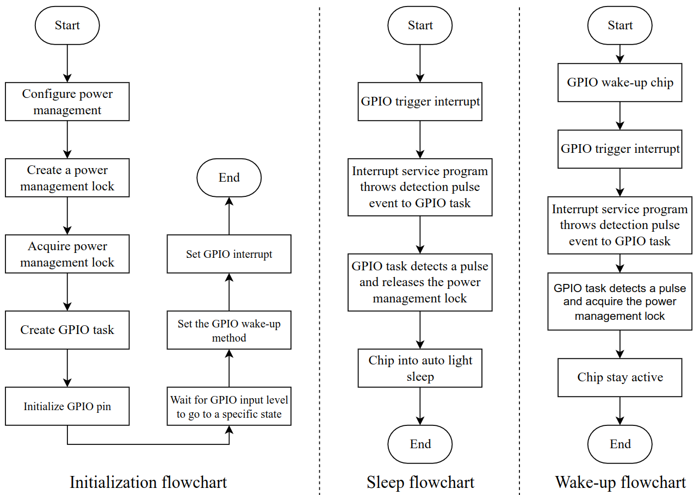

注1：GPIO task 的优先级要高于 0 级，因为 idle task 的优先级是 0 级。

注2：使用脉冲模式时，要注意去抖，防止因为抖动而导致无法检测到完整脉冲。

##### Low Level

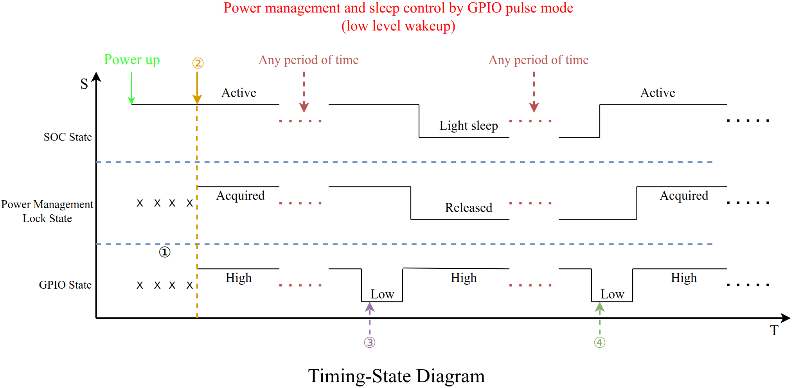

1. 开发板刚上电，还未初始化，所以电源管理锁和 GPIO 状态都不确定。
2. 初始化
   1. 由于设置的低电平触发中断，所以 GPIO 初始化时，设置内部上拉电阻（示例默认使用内部上下拉电阻，也可以配置为不使用），保证 GPIO 输入高电平。
   2. 设置 GPIO 唤醒电平为低电平。由于 ESP-C6 和 ESP-H2 支持 digital peripherals 掉电，所以如果配置了 digital peripherals 掉电，应使用 lp io 唤醒 或者 ext1 唤醒。
   3. 设置低电平中断。
3. 释放锁
   1. GPIO 输入低电平，触发 GPIO 中断，中断服务程序向 GPIO task 中检测脉冲的事件。
   2. GPIO task 检测到脉冲后，完成释放锁的操作，之后芯片进入 auto light sleep。
4. 获取锁
   1. GPIO 输入低电平，芯片被唤醒，并触发 GPIO 中断，中断服务程序向 GPIO task 中检测脉冲的事件。
   2. GPIO task 检测到脉冲后，完成获取锁的操作，之后芯片保持 active。

该模式的软件状态机如下：

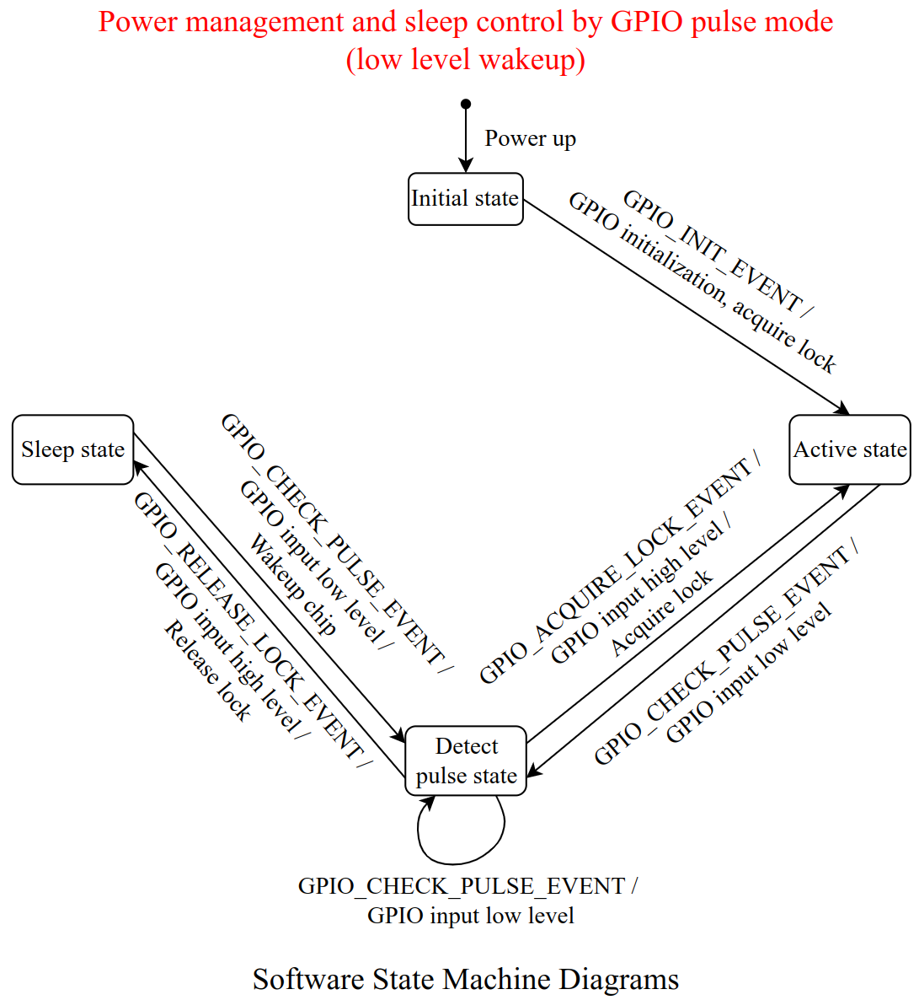

##### High Level

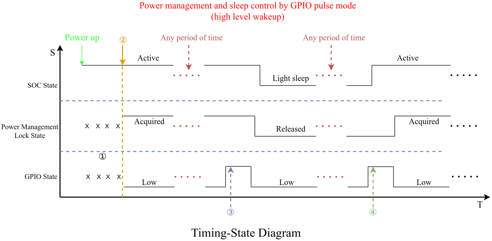

1. 开发板刚上电，还未初始化，所以电源管理锁和 GPIO 状态都不确定。
2. 初始化
   1. 由于设置的高电平触发中断，所以 GPIO 初始化时，设置内部下拉电阻（示例默认使用内部上下拉电阻，也可以配置为不使用），保证 GPIO 输入低电平。
   2. 设置 GPIO 唤醒电平为高电平。由于 ESP-C6 和 ESP-H2 支持 digital peripherals 掉电，所以如果配置了 digital peripherals 掉电，应使用 lp io 唤醒 或者 ext1 唤醒。
   3. 设置高电平中断。
3. 释放锁
   1. GPIO 输入高电平，触发 GPIO 中断，中断服务程序向 GPIO task 中检测脉冲的事件。
   2. GPIO task 检测到脉冲后，完成释放锁的操作，之后芯片进入 auto light sleep。
4. 获取锁
   1. GPIO 输入高电平，芯片被唤醒，并触发 GPIO 中断，中断服务程序向 GPIO task 中检测脉冲的事件。
   2. GPIO task 检测到脉冲后，完成获取锁的操作，之后芯片保持 active。

该模式的软件状态机如下：

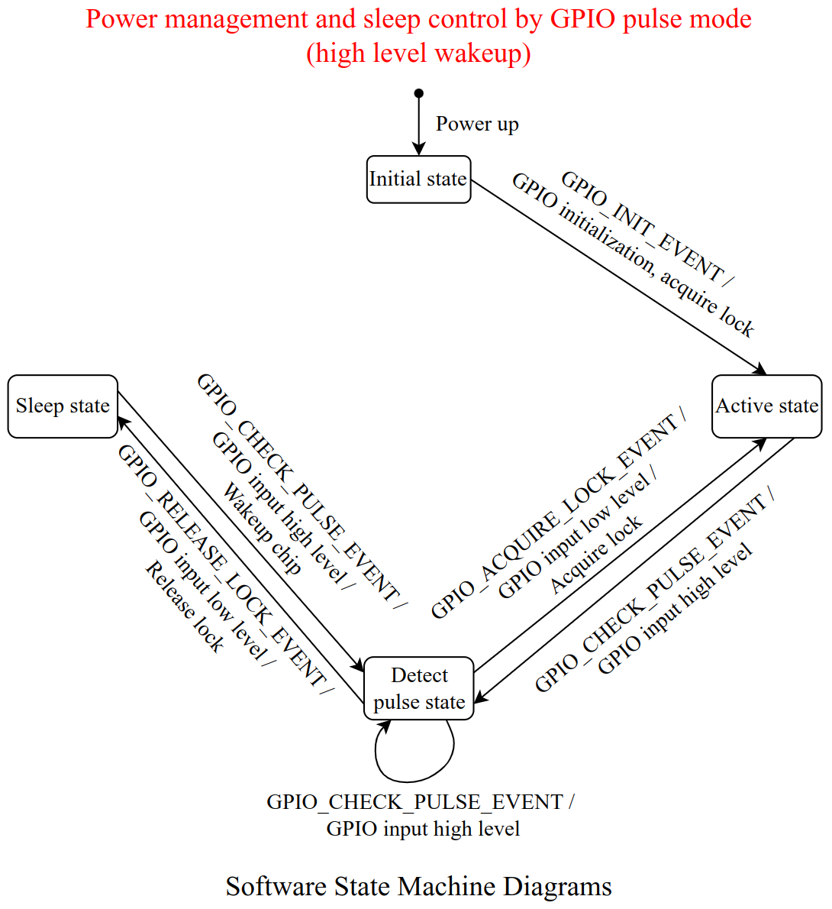

### UART Control

UART 控制的大致思想：通过 UART 唤醒芯片，获取电源管理锁，芯片保持 active，空闲（没有接收到 UART 数据）一段时间后，再释放锁，芯片进入 auto light sleep。

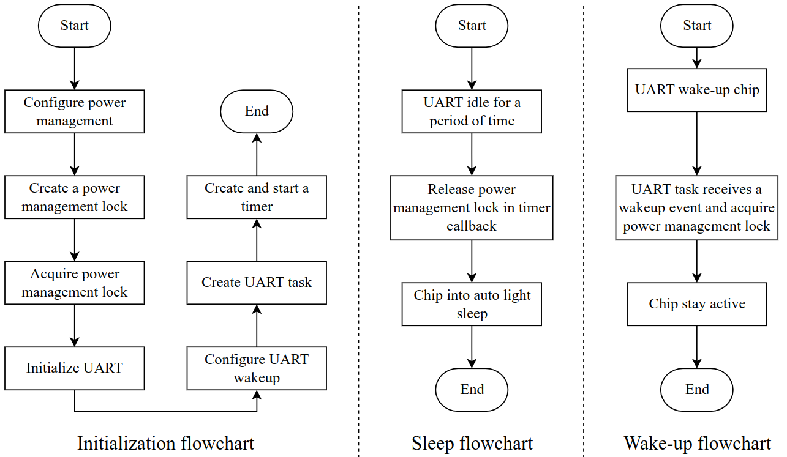

UART 控制的软件状态机如下：

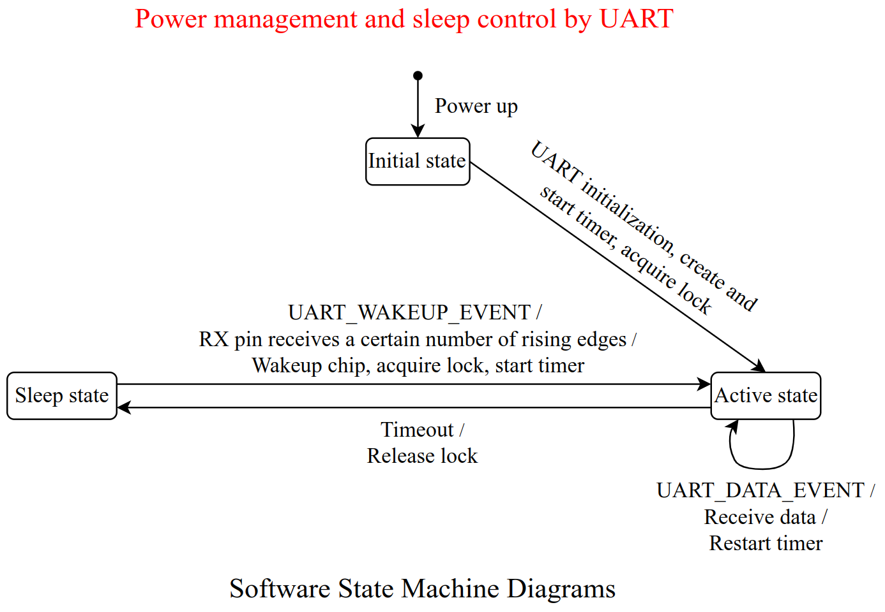